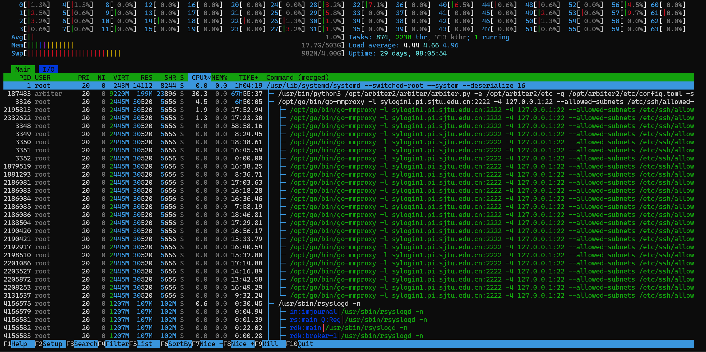

# 配置标准开发环境

## 虚拟机

虚拟机是一种通过软件模拟硬件环境的技术，允许在单一物理主机上运行多个独立的操作系统实例。它通过虚拟化技术将硬件资源抽象为虚拟化的计算单元，从而实现不同操作系统之间的隔离和资源隔离。该技术的主要优势在于完全与主机隔离，可以避免在开发环境中进行误操作影响到主机环境，劣势是相对来说会占用更多的硬件资源。

### VMware

按照教程配置好虚拟机之后打开终端输入 ip a 查看ip,然后主机ssh 上去连接.

虚拟机配置流程：

1. 使用ubuntu-24.04.2-desktop的iso文件安装Ubuntu系统:

2. 配置

```bash
# apt 换源
sudo sed -i 's|http://archive.ubuntu.com|https://mirrors.tuna.tsinghua.edu.cn|g' /etc/apt/sources.list.d/ubuntu.sources
sudo apt-get update
sudo apt-get -y upgrade

# 必要软件
sudo apt-get -y install htop tree build-essential cmake ninja-build openssh-server openmpi-bin openmpi-common libopenmpi-dev nginx traceroute vim tmux curl gparted wireshark net-tools

# pip 换源
mkdir -p ~/.pip
printf '[global]\nindex-url = https://pypi.tuna.tsinghua.edu.cn/simple/' > ~/.pip/pip.conf

# common folders
mkdir -p ~/apps
mkdir -p ~/scripts

# install conda
export __MY_CONDA_INSTALL_PATH=~/apps/miniconda3
mkdir -p $__MY_CONDA_INSTALL_PATH
wget https://repo.anaconda.com/miniconda/Miniconda3-latest-Linux-x86_64.sh -O $__MY_CONDA_INSTALL_PATH/miniconda.sh
bash $__MY_CONDA_INSTALL_PATH/miniconda.sh -b -u -p $__MY_CONDA_INSTALL_PATH
rm $__MY_CONDA_INSTALL_PATH/miniconda.sh
unset __MY_CONDA_INSTALL_PATH

# nginx is only used for experiment
sudo systemctl disable nginx.service


# 安装docker
# Add Docker's official GPG key:
sudo apt-get update
sudo apt-get install ca-certificates curl
sudo install -m 0755 -d /etc/apt/keyrings
sudo curl -fsSL https://download.docker.com/linux/ubuntu/gpg -o /etc/apt/keyrings/docker.asc
sudo chmod a+r /etc/apt/keyrings/docker.asc

# Add the repository to Apt sources:
echo \
"deb [arch=$(dpkg --print-architecture) signed-by=/etc/apt/keyrings/docker.asc] https://download.docker.com/linux/ubuntu \
$(. /etc/os-release && echo "${UBUNTU_CODENAME:-$VERSION_CODENAME}") stable" | \
sudo tee /etc/apt/sources.list.d/docker.list > /dev/null
sudo apt-get update

# 安装docker
sudo apt-get install docker-ce docker-ce-cli containerd.io docker-buildx-plugin docker-compose-plugin

sudo usermod -aG docker xflops
sudo usermod -aG wireshark xflops
```

### WSL

WSL 是微软开发的一项技术，允许用户在 Windows 操作系统上直接运行 Linux 操作系统的二进制可执行文件，无需通过虚拟机或双启动方式。其具有高效资源利用和可以直接跨系统文件访问的优势。但是 WSL 的操作会影响主机系统

### Docker

Docker 是 Docker 公司开发的一项技术，允许用户在操作系统上通过容器化的方式运行应用程序及其依赖环境，无需依赖传统的虚拟机。其具有轻量级、启动快速和环境一致性的优势。但是 Docker 的容器隔离并非绝对安全，若在容器中进行高危操作或配置不当，可能会对主机系统的资源和安全造成潜在影响。


# 基础工具学习

## Shell

**简单来讲，shell就是一个包含一系列命令的文本文件**

### 创建执行shell脚本

在linux系统上脚本文件通常是后缀为 `.sh`的文件，可以使用chmod +x script.sh 给脚本添加执行权限，然后执行脚本
```bash
./script.sh
bash script.sh
source script.sh
```

前面两种会在一个新的子shell里面执行交本，这意味着脚本里面的变量和环境设置不会影响当前shell的环境。 而第三种方式 `source script.sh` 会在当前shell执行脚本

第一种方式要求 script.sh 有可执行权限，第二第三种不需要。 如果当时shell不是bash而是dash，zsh等其他shell，那么第一种和第三种方式会使用当前shell运行，而第二种方式强制使用bash运行。

### Shell脚本语法
Shell 脚本中的所有语法都和shell语法一致，接下来简单介绍一些shell语法

- 定义函数

```bash

#define the function in a shell script
mdc() {
  mkdir -p "$1"
  cd "$1"
}
```

- 逻辑控制

- - if语句

```bash

if [ condition ]
then
  # if true command
elif [condition]
then
  # elif true command
else
  # if all not required,command
fi
```

example:
```bash
#!/bin/bash
if [$1 -eq 10]; then
  echo "parameter = 10"
else
  echo "parameter != 10"
fi
```

常见的条件符:

- 整数比较
- - -eq  equal 
- - -ne  not equal
- - -gt greater than
- - -lt less than
- - -ge greater than or equal
- - -le less than or equal

- string comparition
- - = == : equal
- - != : not equal
- - < ,> : 比较字符串的字典序 (需要使用 [[...]])

- 文件测试
- - -e: file exists
- - -f: 普通文件存在
- - -d: 目录存在
- - -r: 文件可读
- - -w: 文件可写
- - -x: 文件可执行
--- 
- - for循环

```bash
for var in list
do
  # 循环体
done
```

- - while循环
while循环根据给定的条件重复执行命令，直到条件不再满足
```bash
while [ condition ]
do
  #...
done
```

example:
```bash
#!/bin/bash
count=1
while [ $count -le 5 ]
do
  echo "计数: $count"
  ((count++))
done
```

```bash
#!/bin/bash
while read line
do
  echo "读取到的行:  $line"
done < inputfile.text
```

break 和 continue.

## Git

Git 是一款分布式版本控制系统，由 Linus Torvalds 开发，用于高效管理项目代码的变更。它的核心功能是记录文件的历史修改，支持多人协作开发，并允许随时回溯到任意版本

Git 的核心功能包括：

1. 版本追踪：每次修改提交（commit）都会生成唯一快照，便于追溯问题或恢复代码。
2. 分支管理：开发者可创建独立分支（branch）进行功能开发，完成后合并（merge）到主分支，避免冲突。
3. 分布式协作：每个成员拥有完整的代码仓库，支持离线工作，通过推送（push）/拉取（pull）与团队同步。

基础操作:

- git help < command> 获取某个git命令的帮助文档
- git init  initialize a git repository. Data stored in .git
- git status
- git add < filename>
- git commit (create a commit)

- git log 显示日志
- git log --all --graph --decorate 以DAG展示历史
- git diff < filename> 显示某个文件相对于staging area 的差异
- git diff < revision> < filename> 显示一个文件在不同快照之间的差异
- git checkout < revision>: 更新 HEAD指针

- git branch 显示分支
- git branch < name> 创建分支
- git checkout -b < name> 创建一个新分支并切换过去
- - == git branch < name> + git checkout < name>
- git merge < revision> 将指定的合并
- git mergetool 启动图形化工具解决合并冲突
- git rabase 将一系列提交应用到另外一个基底上面

远程仓库:
- git remote -v : 列出所有已经配置的远程仓库
- git remote add < name> < url> 添加一个新的远程仓库
- git push < remote> < local bracnh>:< remote branch> 对象推送到远程并更新引用
- git branch -u < remote> [< branchname>]: 在本地分支和远程分支建立追踪关系
- git fetch: 从延迟仓库抓对象和引用，不合并
- git pull: 从远程抓并合并
- git clone: 从远程下

撤销操作:
- git commit -amend 修改最后一次
- git reset HEAD < file>: 将文件移除暂存区
- git checkout -- < file>: 丢弃在工作区中对某个文件的所有修改

## Tmux

命令行的典型使用方式是，打开一个终端窗口（terminal window，以下简称"窗口"），在里面输入命令。用户与计算机的这种临时的交互，称为一次"会话"（session）。重要的一点是，窗口与其中存在的进程是相互依存的，打开窗口，会话开始，关闭窗口会话就会结束，会话内部的进程也会随之终止

而Tmux则是让会话和窗口解绑的工具. 断开ssh or 关闭终端的话，tmux也能保持会话运行。重新登陆后，只需要恢复对话就能继续工作。

**会话 sessions**
- 一个会话是一个独立的工作区,可以包含一个或多个窗口
- tmux启动一个对话
- tmux new -s NAME 创建NAME对话
- tmux ls 列出当前所有对话
- tmux中输出 < C-b > d 以分离当前对话
- tmux a 附加到上一个对话

**Windows**
- < C-b > c 创建一个窗口，要关闭只需要 < C-d >终止shell
- < C-b > N 切换到N号窗口
- < C-b > p 切换到前一个窗口
- < C-b > n 切换到后一个窗口
- < C-b > , 重命名当前窗口
- < C-b > w 列出当前所有窗口

**Panes** 类似vim的分屏，一个窗口多个shell
- < C-b > " 水平分割
- < C-b > % 垂直分割
- < C-b > < direction> 移动到指定方向的窗格
- < C-b > z 切换当前窗格的全屏/非全屏模式
- < C-b > [ 进入回滚模式，按space开始选择，enter复制
- < C-b > < space> 在不同的窗格布局之间循环切换

## htop
---
htop是交互式的进程查看器和系统监视工具



1. 最上方为 CPU 核心占用情况，其中红色部分表示处在内核态，绿色部分表示处在用户态
2. 上左区：显示了 CPU、物理内存和交换分区的信息；
3. 上右区：显示了任务数量、平均负载和连接运行时间等信息；
4. 进程区域：显示出当前系统中的所有进程；
5. 操作提示区：显示了当前界面中 F1-F10 功能键中定义的快捷功能。

**Memory Bar**:
1. 绿色的表示已经使用的内存
2. 蓝色的缓冲
3. 黄色的表示用于缓存

**Process Panal**:
S: 进程情况
1. R 正在运行
2. S 休眠
3. Z 僵死
4. N 优先值是负数

## Vim
---
Vim Editor Mode
---

1. 正常模式（Normal mode）：启动 Vim 时的默认模式。用于执行命令，同时可以方便地进行微调。
2. 插入模式（Insert mode）：用于文本输入。可以通过以下命令进入插入模式。
3. 可视模式（Visual mode）：用于选择文本，可以用来复制或剪切。

vim 是一个终端里的文本编辑器。你可以把它理解成：

在没有图形界面的 Linux 服务器上，直接编辑代码和配置文件。

从正常模式进入插入模式

- 按 i 进入插入模式，允许你在光标前输入文本。（Insert）
- 按 I 在当前行的行首插入文本。
- 按 a 在光标后插入文本。
- 按 A 在当前行的行尾插入文本。
- 按 o 在当前行下方插入新行。（Open）
- 按 O 在当前行上方插入新行。

从插入模式返回正常模式
- 按Esc键返回正常模式

这个地方不常用，不多赘述.

## 正则表达式
---

正则表达式（Regular Expression，简称 Regex 或 Regexp）是一种用于描述字符串模式的语言。它可以用来匹配、查找、替换文本中的特定模式。正则表达式由普通字符（如字母、数字）和特殊字符（称为"元字符"）组成，这些元字符赋予了正则表达式强大的模式匹配能力。

基础语法:

`.`  匹配任意单个字符(除了换行符)  `a.c`  -> "abc" "aac"

`^` 匹配字符串的开始位置  `^Hello` -> "Hello world"

`$` 匹配字符串的结束位置   `world$` -> "Hello world"

`*` 匹配前一个元素0次或多次 `ab*c` -> "ac", "abbc"

`+` 匹配前一个元素1次或多次 `ab+c` -> "abc", "abbc"

`?` 匹配前一个元素0次或者一次 `colou?r` -> "color" , "colour"

`[...]` 匹配括号内的任意字符 `[aeiou]` -> "a" in "apple"

`[^...]` 匹配不在括号内的任意字符 `[^0-9]` -> "a" in "a1"

`|` 逻辑或(匹配左边or右边)  `cat\|dog` -> "cat" , "dog"

`{n}` 精准匹配n次  `a{3}`-> "aaa"

`{n,}` 匹配至少n次 `a{2,}` -> "aa" "aaa"

`{n,m}` 匹配n到m次 `a{2,4}` -> "aa","aaa"

特殊字符类:
---

`\d` -> 等效 `[0-9]` 匹配数字
`\w` -> 等效 `[a-zA-Z0-0_]` 匹配字母和下划线
`\s` -> 等效 `[ \t\r\n\f]` 匹配空白字符
`\D` -> 等效 `[^0-9]` 匹配非数字字符
`\W` -> 等效 `[^\w]` 匹配非单词字符
`\S` -> 等效 `[^\s]` 匹配非空白字符
`\b` -> 匹配单词边界


转义字符
---
在正则表达式中，一些字符具有特殊含义，如 .、*、+ 等。如果需要匹配这些字符本身，需要使用反斜杠 \ 进行转义。特别地，部分引擎转义规则与常见的相反，即匹配字符本身不需要转义，而使用这些元字符的属性则需要使用反斜杠 \ 转义

分组与捕获
---
使用括号 () 可以创建捕获组，结果将被存储在捕获变量中：
```
(\d{4})-(\d{2})-(\d{2})
```
匹配日期格式 "YYYY-MM-DD"

并捕获 `$1` 年，四位数字 `$2` 月 `$3` 日

使用(?:) 可以创建分组作用
```
(?:\d{3}-)?\d{3}-\d{4}
```


常用的正则表达式示例:
---

邮箱验证：

```
^[\w.-]+@[\w.-]+\.[a-zA-Z]{2,6}$
```

URL 匹配：

```
https?://(?:[-\w]+\.)+[\w]{2,}(?:/[^\s]*)?
```

IP 地址匹配：

```
\b(?:\d{1,3}\.){3}\d{1,3}\b
```

功能较为复杂的正则表达式的纯文本形式近乎是人类不可读的。我们强烈建议在编写和分析正则表达式时使用可视化编写工具，例如 regex101。常见的可视化编写工具均支持多种语言的正则表达式的语法，同时会解析输入的正则表达式的含义，并提供了在线匹配的功能。

## 正则表达式的应用

正则表达式有着广泛的应用，在终端命令，编程语言与应用搜索中均能见到。

终端命令
- grep: 文本搜索

```bash
grep -E 'patter' file.txt # 使用扩展正则
```
- sed 流编辑器
```bash
sed -E 's/old/new/g' file.txt # 全局替换，注意此时'/'作为分隔符也需要转义
sed -E 's#old#new#g' file.txt # 也可以使用其他字符作为分隔符
```

- awk 文本处理
```bash
awk '/pattern/{print $0}` file.txt`
```

