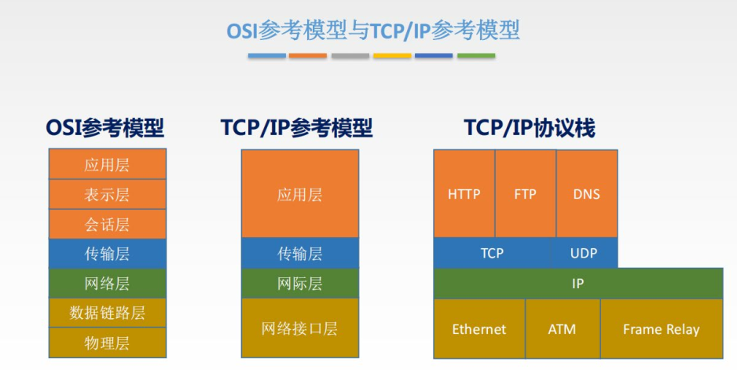

# Wire Shark

Wireshark 是目前主流的抓包工具之一，本节将结合 Wireshark 抓包来讲解计算机网络模型

访问 http://180.76.151.202/home/index.mooc，wireshark 便能抓取对应的 http 流量。在过滤器中输入 http.host == 180.76.151.202 可以找到对应网络包数据。

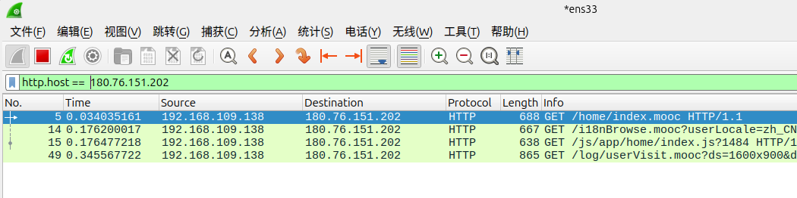

右键点击网络包，选择追踪其 TCP 流。

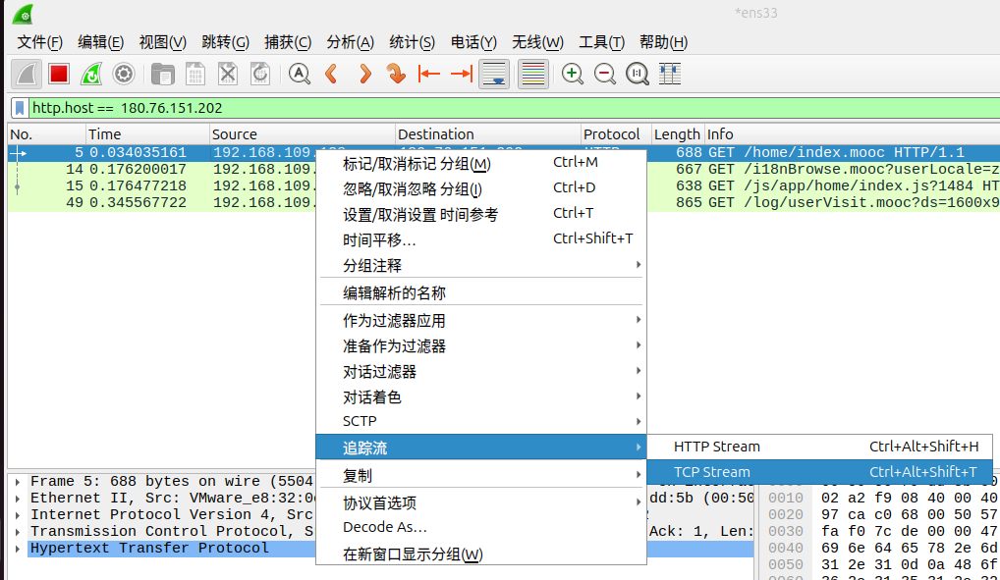

对应的 TCP 流网络数据包如图所示。我们将以此为例进行后续的讲解。

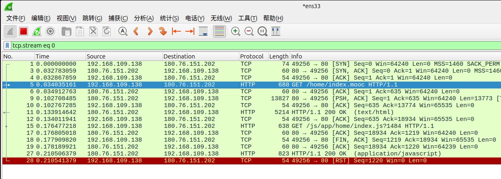

# 网络接口层
该层对应于 OSI 模型的物理层与数据链路层。物理层为光纤等传输设备，本部分主要介绍数据链路层的相关部分

选择第一个包，其 ethernet 帧信息如图所示。（实际数据会根据本机网络信息不同而不同，此处仅供参考）

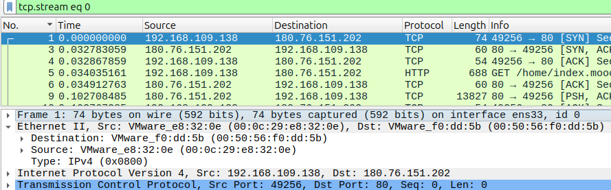

- Ethernet（以太网）在 TCP/IP 协议层中属于网络接口层，在 OSI 参考模型中对应数据链路层。Ethernet II 标准是最常用的以太网帧格式，用于承载 IP 等上层协议。
- Destination 和 Source 分别指向目标设备与源设备的名字以及 MAC 地址。如图中 VMware_e8:32:0e 和 VMware_f0:dd:5b 都是 VMware 虚拟网络设备，而 00:0c:29:e8:32:0e 是此虚拟机的 MAC 地址，00:50:56:f0:dd:59 是 VMware 虚拟网关的 MAC 地址，两者的 MAC 地址都是唯一标识的。
- "Type：IPv4" 表明其上层（网络层）使用的协议为 IPv4。

## MAC 地址（物理地址）
---
MAC 地址（Media Access Control Address，媒体访问控制地址）是网络设备的一个唯一标识符，用于数据链路层。在局域网（LAN）中，MAC 地址用于识别网络设备，以便数据帧能够准确地在网络上进行传输。以下是关于 MAC 地址的详细介绍：

基本概念
- 唯一性：MAC 地址是全球唯一的，每个网络接口卡（NIC）或网络适配器出厂时都被赋予一个独特的 MAC 地址。
- 长度与格式：MAC 地址通常是 48 位（6 字节）长，通常用十二个十六进制字符表示，例如：08:00:27:13:69:77 或 08-00-27-13-69-77。
- 分配：前 24 位由 IEEE 分配给网络设备制造商，称为组织唯一标识符（OUI），后 24 位由制造商自行分配。
结构与组成
- OUI（组织唯一标识符）：用于标识设备制造商，前 24 位（3 字节）。
- 设备标识符：用于标识特定设备，后 24 位（3 字节）。
- 局部管理位：第 7 位可用于标记地址为全局唯一（0）或本地管理（1）。
功能与用途
- 设备识别：在局域网中，MAC 地址用于识别和定位网络节点，便于交换机和其他设备在数据链路层管理数据传输。
- 数据帧传输：网络设备使用 MAC 地址进行帧传输，通过 ARP（地址解析协议）将 IP 地址解析为 MAC 地址，从而在以太网上传输数据。
- 网络访问控制：通过 MAC 地址过滤，网络管理员可以设置哪些设备可以连接到网络。


## 交换机

交换机（Switch）是网络通信中一种重要的设备，负责在网络设备之间转发数据包。它在局域网（LAN）中常被用于连接计算机、服务器、打印机和其他网络设备。

其基本功能有
1. 数据包交换
- 交换机通过接受、处理、转发数据包链接网络设备
- 他根据目标地址将数据包转发到正确的输出端口
2. MAC地址学习
- 交换机通过学习连接设备的MAC地址，维护一张MAC地址表
- 根据这张表，交换机能够准确的将数据包发送到目标设备，避免不必要的流量
3. 数据帧转发
- 全双工通信模式，交换机可以同时发送和接受数据帧，减少碰撞


# 网络层

同样使用第一个网络包，得到它的 IP 帧具体信息。

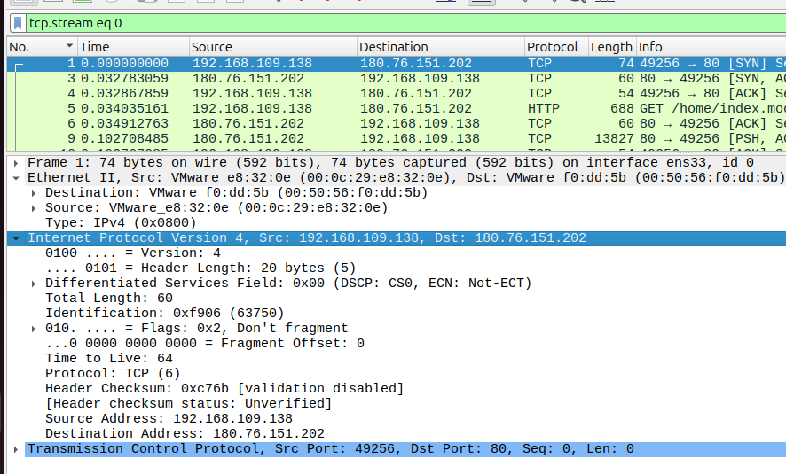

- Internet Protocol Version 4 即 IPv4 网络层协议。
- Src 和 Dst 标识源 IP 地址和目标 IP 地址，其中源 IP 地址 192.168.109.138 是局域网地址即私有 IP，目标 IP 地址 180.76.151.202 是公网 IP。
- Time to Live 即 TTL，用于防止数据包在网络中无限循环。每经过一个路由器 TTL 减 1，减到 0 时路由器丢弃包并返回 ICMP 超时。
- "Protocol: TCP" 表明其上层（传输层）使用的协议为 TCP。

## IP地址

公网 IP（Public IP Address）是用于在互联网（Internet）中识别和通信的唯一 IP 地址。每个连接到互联网的设备都需要一个公网 IP 地址，以便能够与全球其他设备进行通信。公网 IP 地址由互联网服务提供商（ISP）分配，并且是全球唯一的，不能重复。

**公网IP与私有IP**:

- 公网IP:
- - 用于互联网通讯，全球唯一
- - 由 ISP分配，需要支付费用
- - 直接暴露在互联网，容易成为攻击目标

- 私有IP
- - 用于局域网LANh内的通信，不在互联网中使用
- - 可以在不同的局域网内重复使用
- - 由路由器or 网关设备通过网络地址转换 (NAT Network Address Translation) 映射到公网IP地址，实现互联网访问

根据互联网编号分配机构（IANA）的规定，私有 IP 地址分为三个范围，分别适用于不同规模的局域网：

A 类私有地址：10.0.0.0 - 10.255.255.255

B 类私有地址：172.16.0.0 - 172.31.255.255

C 类私有地址：192.168.0.0 - 192.168.255.255


**IPV4与IPV6**:

IPV4:

IPv4 地址是一个32位的二进制数，通常采用点分十进制表示，将32位划分为4组，每组写成一个十进制数字 (所以十进制取值为0~255)，  用.分割，如192.168.1.1

```
由于 IPv4 使用 32bit 作为记录，其最多只有约 40 亿种组合形式，因此随着互联网的发展，IPv4 出现了地址不足的问题，因此使用 128bit 的 IPv6 地址应运而生
```

IPV6:

IPv6 地址是一个 128 位的二进制数。 采用冒号十六进制表示，由 8 组 4 个十六进制数组成，用冒号 : 分隔。

支持地址压缩，省略每一组前面的0，用双冒号代替全是0的组

`2001:0db8:85a3:0000:0000:8a2e:0370:7334`

压缩后为 `2001:db8:85a3::8a2e:370:7334`


本地回环地址: 本地回环地址一般用于计算机本地的网络通信与测试。在 IPv4 中规定 127.0.0.0/8 的地址均用于本地回环测试，一般我们使用 127.0.0.1 作为本地回环地址。 IPv6 也提供了本地回环地址 0:0:0:0:0:0:0:1，一般简写为::1。


## 子网

子网是将一个大型 IP 网络（如局域网或广域网）通过技术手段分割成的多个小型逻辑网络。它并非物理上的独立网络，而是通过 IP 地址和子网掩码的组合，在逻辑上划分出的子区域。一个子网可由该子网内的任一 IP 地址和子网掩码确定。

子网掩码是一个 32 位的二进制数（与 IPv4 地址长度一致），其必须由一组连续的 1 和一组连续的 0 组成，和用于区分 IP 地址中的 网络位 和 主机位，从而确定该 IP 地址属于哪个子网。子网内的任一 IP 与子网掩码按位与得到的结果必须一致，我们称这个结果为子网的网络地址。子网掩码通常使用点分十进制表示。由于子网掩码实际上可以使用前缀 1 的长度唯一确定，因此也可以使用子网掩码的长度来表示子网掩码。

传统的子网划分方式使用 A/B/C 类地址划分，仅有 3 种子网大小可供选择。为简化子网划分，CIDR（Classless Inter-Domain Routing）用前缀长度（如 /24）代替传统的 A/B/C 类地址划分，更灵活地分配网络位和主机位。通常我们使用CIDR 表示法表示一个子网，写作<子网网络地址>/<子网掩码的长度>。

例子:

- CIDR 表示法：192.168.1.0/24
- 网络地址：192.168.1.0
- 广播地址：192.168.1.255
- 子网掩码：255.255.255.0
- 子网 IP 范围：192.168.1.0 - 192.168.1.255
- 子网可用 IP 范围：192.168.1.1 - 192.168.1.254


所以一般 `192.168.1.1` ~ `192.168.1.254` 都是子网的地址， 0和255分别用于网络地址和广播地址


## 网关

网关是计算机网络中的一个重要组件，其主要作用是连接不同网络，并在这些网络之间进行数据的流动和转换。由于不同网络可能使用不同的协议或数据格式，网关在网络间充当协议转换器、数据格式转换器和路由器的角色。以下是对网关的详细介绍：

网关的主要功能：

1. 协议转换： 网关负责在使用不同通信协议的网络之间进行协议翻译。例如，在一个使用 TCP/IP 协议的网络和一个使用 X.25 协议的网络之间，网关可以转换数据格式和通信协议，以确保两个网络可以互相通信。
2. 数据格式转换： 不同网络可能使用不同的数据格式，网关能够对数据进行格式转换，使数据在传输到目的网络时符合该网络的格式要求。
3. 路由和数据转发： 网关可以根据目的地址选择合适的路径，将数据包从一个网络传递到另一个网络。它可以作为路由器的一种形式，管理数据包的流动。
4. 网络连接和隔离： 网关可以提供网络连接和隔离，确保内部网络与外部网络（如互联网）之间的安全通信。它可以应用于企业网络中，实现不同子网或部门之间的安全隔离与连接。


一个子网的设备如果需要访问子网外的 IP 需要将数据包发送给网关，由网关负责转发（通常这个网关设备就是我们所说的路由器）。在手动配置子网信息时需要填写一个网关，其即为用于转发数据包到外部网络的设备的 IP 地址。

## NAT

想用私有地址与 Internet 连接来访问公网，那该怎么做？这就需要将私有 IP 地址转换成公网 IP 地址，与外部连接。通常我们使用 NAT（网络地址转换 Network Address Translation） 技术实现。

NAT 技术最核心的功能是实现地址转换：它可以将一个子网内所有设备的地址，统一转换为运行 **NAT 软件的网关（如路由器）自身的地址**，再通过这个网关地址与外部网络进行通信。这里的子网地址和网关地址并不局限于特定类型，既可以是私有地址，也可以是公有地址，关键是通过网关的地址作为中间桥梁，实现子网与外部网络的连接。​

```
原始：
src = 192.168.1.10
dst = 8.8.8.8

经过 NAT：

src = 202.x.x.x
dst = 8.8.8.8
```
# 传输层

观察此 TCP 流，在最开始由客户端发送带有 SYN 标志的数据包到服务器，随后由服务器发送有 SYN-ACK 标志的数据包，然后客户端发送带有 ACK 标志的数据包。这就是 TCP 的三次握手，在握手成功后建立 TCP 连接，双方开始传输数据。

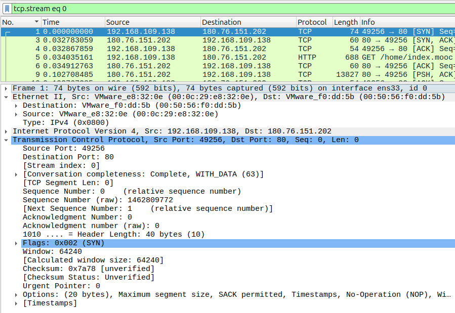

## 端口

端口是一个逻辑概念，表示通信会话的特定端点，每个端口号和ip结合起来区分，用于区分不同的网络服务和应用程序

1. 端口号：
- 端口号16位整数，从 0~65535
- 每个端口号对应一种也顶的网络服务或者应用程序
2. 作用:
- 端口号用于在同一个IP地址下区分不同的网络服务，例如HTTP协议通常使用端口80，HTTPS使用端口443。
- 端口使得一台计算机可以同时运行多个网络服务。
3. 端口的分类:
- 知名端口 (Well-Know Ports) : 0 to 1023 分配给常见的协议和服务  FTP 21  SSH 22 HTTP 80 HTTPS 443
- 注册端口: 1024 ~ 49151, 分配给用户注册的服务和应用程序
- 动态/私有端口: 49152 to 65535，通常为临时端口

**端口的使用**

- 服务器端端口， 服务器通常监听一个特定端口，以便于接受来自客户端的连接，例如web服务器监听80端口以接受HTTP请求
- 客户端端口： 客户端通常在 动态/私有端口范围内随机选择一个端口，用于发送请求和接收响应

**端口在数据传输中的角色**

- 数据通过TCP和UDP从一个设备传输到另外一个设备的时候，源端口和目的端口在数据包的头部被标记

**端口管理**:
- 防火墙: 通过防火墙规则可以管理端口的访问权限，确保只有授权的流量可以通过
- 端口扫描： 检测开放的端口以确定安全漏洞。


TCP
---

TCP (传输控制协议: Transmission Control Protocol) 是互联网协议套件中最关键的传输层协议之一，与UDP相对，可靠。

**TCP的基本特性**:
1. 面向连接: TCP是面向连接的，需要先进行三次握手
2. 可靠性: TCP提供可靠的数据传输
3. 顺序保证
4. 流量控制
5. 拥塞控制

**三次握手**:
1. SYN 发送一个SYN数据包
2. SYN-ACK 服务器接收到SYN数据包之后返回一个SYN-ACK数据包，确认客户端的SYN亲求
3. ACK: 客户端收到SYN-ACK后，发送一个ACK数据包给服务器

**数据传输**:

每个TCP都包含一个序列号，按照序列号发送，接收方会给发送方发送它确认收到的字节

**优缺点**:

- 可靠性
- 流量控制
- 顺序性
- 广泛应用

- 开销较大
- 速度慢

**TCP的场景**:
- 网页浏览
- 文件传输
- 电子邮件
- 远程登陆


**UDP**:
===
UDP（用户数据报协议，User Datagram Protocol）是一个简单、无连接的传输层协议，它是 TCP/IP 协议族的一部分。UDP 用于需要快速传输且对丢包不太敏感的应用场景。以下是对 UDP 的详细介绍：

UDP 的特点
1. 无连接：
- UDP 是无连接协议，通信双方在发送数据之前不需要建立连接。这减少了通信开销和延迟，使得数据可以更快地传输。
2. 不可靠传输：
- UDP 不保证数据包的可靠性。数据包可能会丢失、重复或乱序到达。应用程序需要自行处理这些问题。
3. 简单的报文结构：
- UDP 的报文结构简单，只有 8 字节的头部，包括源端口、目的端口、长度和校验和等字段。这种简单性使得 UDP 数据包的处理速度更快。
4. 无拥塞控制：
- UDP 没有内置的拥塞控制机制，适用于对延迟敏感但不需要可靠传输的应用，如实时视频流和在线游戏。
5. 面向报文：
- UDP 是面向报文的协议，每个 UDP 数据包独立处理，不合并或拆分数据包。

应用
---
1. 实时应用
- 流媒体传输: 如音乐和视频
- 在线游戏
2. 简单查询和响应
- DNS 查询
- DHCP  用于网络的地址分批
3. 物联网
- 轻量级应用场景中，物联网设备使用UDP来减少通信的开销和复杂性


# 应用层

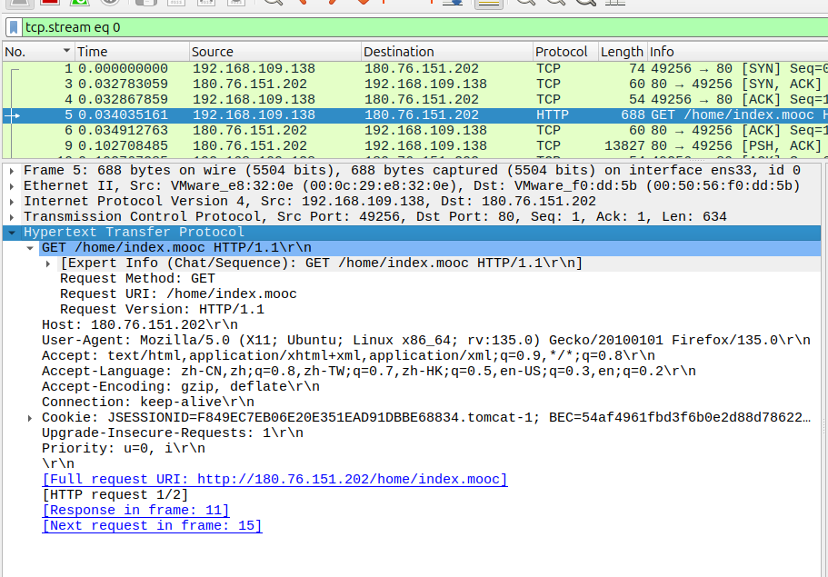

- Hypertext Transfer Protocol 即 HTTP 协议，位于应用层。该网络包数据是客户端向服务器发起的 HTTP 请求报文。
- 请求方法是 GET，请求的资源地址是 /home/index.mooc，HTTP/1.1 是协议版本。
- 后续内容是 HTTP 请求头字段的内容，请求头通过键值对传递客户端信息、请求偏好等，如 Host 指定服务器的域名或 IP，User-Agent 标识客户端类型（浏览器、系统版本、内核等），Accept 向服务器通知客户端能接受的响应内容类型。


HTTP:
---
最常见的协议

1. 无状态协议:每个请求都是独立的，与之前的请求没有直接关系，服务器不会自动保留以前的请求信息
2. 请求-响应模式: HTTP基于请求-响应模型，客户端发起请求，服务器返回响应。这包括请求行/头/体  | 响应行、头、体
3. 灵活性和可拓展性: HTTP可以通过头部字段拓展新的功能，而不影响协议的基本框架
4. 无连接: HTTP初始设计是无连接的，每次只处理一个请求/响应对，然后关闭连接

**HTTP方法**:

- GET: 请求从服务器获取资源，通常用于获取页面内容
- POST: 向服务器提交数据，比如表单数据。常用于数据提交和处理
- PUT: 上传文件到指定位置
- DELETE: 删除指定资源
- HAED: 与GET类似，但只响应请求头
- OPTIONS: 返回服务器支持的HTTP请求方法
- PATCH: 对资源进行部分修改

**HTTP的使用场景**:

HTTP广泛用于Web浏览，包括访问网站，下载文件，提交表单等等。随着互联网的发展，HTTP不只是用于浏览网页，还包括API通信、物联网等多种业务。

**DNS**:

DNS
---
DNS(域名系统: Domain Name System) 可以理解喂互联网的 "电话簿"。 它的主要作用是将人类易于记忆的域名转换为计算机用的IP地址，我们需要向网络中的一台主机访问对应域名的IP地址，这台主机是DNS服务器。

DHCP
---
DHCP 是一种网络协议，用于自动分配IP地址和其他网络配置信息给网络设备，使其能够快速加入网络并正常通信。

DHCP的主要功能包括

1. 动态分配IP地址: 自动为IP分配可用的IP地址
2. 提供网络配置信息:
- 子网掩码
- 默认网关
- DNS服务器地址
- 时间服务器(NTP Server) 等
3. IP地址管理:
- 防止IP地址冲突
- 提供IP地址租期管理，设备不再需要的时候回收并重新分配。

现代系统一般默认使用DHCP协议获取网络信息，在设备加入一个新的网络时候，将通过以下流程1自动完成IP地址等网络信息的配置.

1. 客户端 (新接入设备) 发送 DHCP Discover 信息
2. DHCP 服务器回复 DHCP Offer 信息， 告知客户端应该使用的网络信息
3. 客户端收到并回复发送 DHCP Request 信息请求使用此IP地址
4. DHCP服务器回复DHCP Ack 确认此IP地址的分配

如果DHCP获取网络信息失败，此时系统将设置自己的IP地址为链路本地地址，169.254.0.0/16 以保证能够在当前子网通信。路由器默认启动了DHCP服务器，在新设备接入路由器会自动为其分配IP地址。


# 练习题

1. 作为华东教育网核心节点，上海交通大学是国内最早建立万兆校园网的高校之一。请计算如果设备使用万兆（10000Mbps）网络下载文件，在操作系统上显示的下载速度约为多少 MB/s？

10000/8 = 1250 MB/s

2. InfiniBand 网络是一种带宽非常高的网络，常用于超算集群的互联。如果在集群的某台机器上安装了一张 100G 的 IB 网卡，请计算理论传输带宽最高可以达到多少GB/s？

这个地方的100G指的是100Gb/s ，不是100GB/s，是12.5 GB/s


3. 
运行下述命令查看你的计算机的网络信息：
```
ifconfig # linux/macos
ipconfig # windows
```

```bash
以太网适配器 Radmin VPN:

   连接特定的 DNS 后缀 . . . . . . . :
   IPv6 地址 . . . . . . . . . . . . : fdfd::1aaf:f07b
   本地链接 IPv6 地址. . . . . . . . : fe80::db9c:dca1:ff4b:7c43%16
   IPv4 地址 . . . . . . . . . . . . : 26.175.240.123
   子网掩码  . . . . . . . . . . . . : 255.0.0.0
   默认网关. . . . . . . . . . . . . : 26.0.0.1

无线局域网适配器 本地连接* 13:

   连接特定的 DNS 后缀 . . . . . . . :
   本地链接 IPv6 地址. . . . . . . . : fe80::56aa:91a4:a2c0:3881%11
   IPv4 地址 . . . . . . . . . . . . : 192.168.137.1
   子网掩码  . . . . . . . . . . . . : 255.255.255.0
   默认网关. . . . . . . . . . . . . :

无线局域网适配器 WLAN 2:

   连接特定的 DNS 后缀 . . . . . . . :
   IPv6 地址 . . . . . . . . . . . . : 2403:d400:1000:12:db40:dc79:5f55:bd57
   临时 IPv6 地址. . . . . . . . . . : 2403:d400:1000:12:41e1:421:4182:74c
   本地链接 IPv6 地址. . . . . . . . : fe80::c279:6df6:e006:2dd4%24
   IPv4 地址 . . . . . . . . . . . . : 10.181.121.185
   子网掩码  . . . . . . . . . . . . : 255.254.0.0
   默认网关. . . . . . . . . . . . . : fe80::56c6:ffff:fe7b:5802%24
                                       10.180.0.1

```


运行下述命令查看你的计算机的端口开放信息：
```
netstat -tulnp # linux/macos
netstat -ano # windows
```

开放的端口很多。例如有些是vpn端口


尝试使用 wireshark 抓包访问 https://xflops.sjtu.edu.cn（超算队官网）的数据包，查看发送数据包的目标 MAC 地址和目标 IP 地址，对比之前实验抓包的 MAC 地址和 IP 地址。并回答:


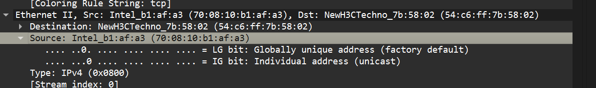

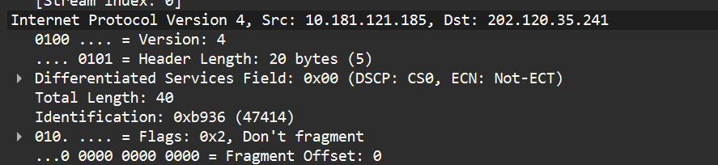


在 wireshark 抓包访问 https://xflops.sjtu.edu.cn（超算队官网）的数据包的记录中搜索 DNS 协议的数据包。确定当前主机使用的 DNS 服务的 IP 地址，并比较 DNS 服务器的回复的 IP 地址和访问网站的数据包的目标 IP 地址是否一致。


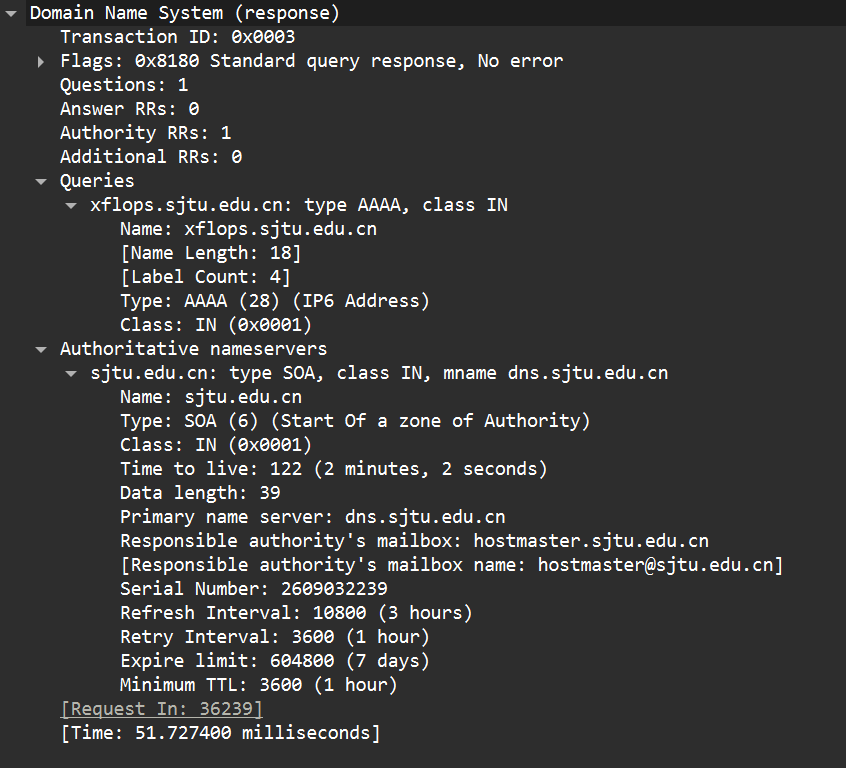


HTTP 协议以明文传输数据包，这将导致的你访问信息被中间人截获/篡改。HTTPS 协议通过添加了加密来保护信息安全。 在 wireshark 抓包访问 https://xflops.sjtu.edu.cn（超算队官网）的数据包的记录中查看通信记录，观察两者如何建立加密连接。并观察建立连接后应用层传输的数据内容是否还可读（可以与 HTTP 抓包实验的应用层内容进行对比）。

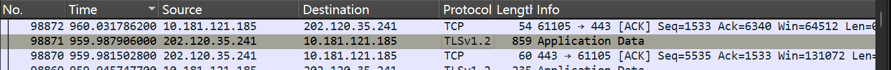

```
Client
  |
  | ClientHello
  |------------------------->
  |
  |              ServerHello
  |<-------------------------
  |
  |       后续 TLS handshake
  |<----------------------->
  |
  |======== 加密完成 ========|
  |
  |     Application Data
  |<----------------------->
```


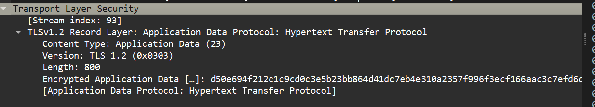

```
Client:
我支持 A / B / C 加密方案

Server:
那我们用 B
```


# SSH

# SSH概述

SSH是一种加密的网络协议，用于安全访问远程计算机

SSH基于TCP协议，默认端口为22

SSH认证原理
---
当你要通过SSH连接到服务器上面的时候，需要验证身份，常见方式有:

1. 口令认证 (Password)
- - 当尝试连接到目标主机的时候，会要求你输入当前主机需要的密码
2. 公私钥认证
- - 在连接的时候，主机和你的电脑将会进行多次交互以验证你当前使用的私钥是否与其云逊链接的公钥中的某一个匹配，如果匹配就成功

# 中间人攻击

SSH协议可以被中间人攻击

你再连接服务器的时候中间人劫持请求冒充服务器和你交互，同时冒充你连接服务器。如果攻击者同时在自己的电脑将请求转发给你，便可监听会话而不被发现。

ssh客户端一般会在known_hosts中存储已经链接过的主机标识及其对应的公钥。当尝试建立新的连接的时候，ssh客户端会主动获取目标主机的公钥，并做比较。

